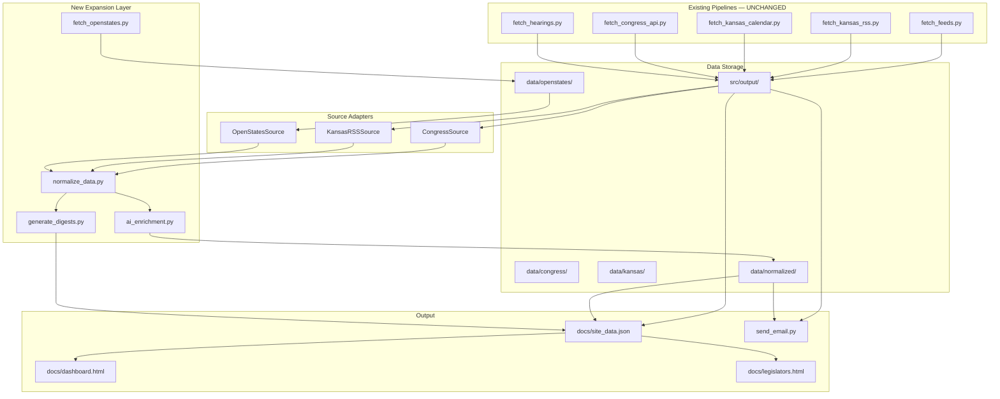

# CivicWatch Expansion Project

## Migration Plan

### Phase 1 — Foundation (Complete)
- Add `config/states.yaml` for state configuration
- Add source adapter architecture under `src/adapters/`
- Add Open States client and fetch pipeline
- Add normalization layer (`normalize_data.py`)
- **No changes to existing fetch scripts** — Congress and Kansas RSS remain untouched

### Phase 2 — Data Layer (Complete)
- Store raw Open States data under `data/openstates/{ks,co,az,ut}/`
- Store adapter copies under `data/congress/` and `data/kansas/`
- Store unified output under `data/normalized/`
- `summarize.py` extended additively with `dashboards`, `search_index`, `states`, `weekly_digests`

### Phase 3 — Frontend (Complete)
- `docs/dashboard.html` — multi-state dashboards + unified search
- `docs/legislators.html` — legislator profiles
- `docs/expansion.js` — shared expansion UI logic
- Existing `index.html`, `hearings.html`, `script.js` unchanged in behavior

### Phase 4 — Automation (Complete)
- New `.github/workflows/openstates.yml` — daily 6:30 PM Central
- New `.github/workflows/tests.yml` — CI test suite
- All existing workflows preserved unchanged

### Phase 5 — Future (Recommended, not implemented)
- Kansas official API (`kslegislature.gov/api/v1/`) as enrichment layer
- Ollama-powered AI summaries in `ai_enrichment.py` (hook exists)
- Federal legislators via Congress.gov member API
- Deprecate legacy `federal_hearings.json` path after cache ages out

---

## Architecture Diagram



---

## Folder Structure (New)

```
config/
  states.yaml                    # State configuration

src/adapters/
  base.py                        # Unified schema + LegislativeSource ABC
  congress_source.py             # Read-only Congress adapter
  kansas_rss_source.py           # Read-only Kansas RSS adapter
  openstates_source.py           # Open States adapter

src/processing/
  openstates_client.py           # API client (pagination, retry, throttle)
  fetch_openstates.py            # Open States ingestion
  normalize_data.py              # Normalization pipeline
  unified_search.py              # Search + dashboards
  ai_enrichment.py               # AI summaries + classification
  generate_digests.py              # Weekly digests by jurisdiction

data/
  congress/                      # Adapter snapshots
  kansas/
  openstates/
    ks/ co/ az/ ut/              # Raw Open States data
  normalized/                    # Unified schema output
  digests/                       # Weekly digests

docs/
  dashboard.html                 # Multi-state dashboards
  legislators.html               # Legislator profiles
  expansion.js                   # Expansion UI

tests/
  test_adapters.py
  test_openstates_client.py
  test_schema.py

.github/workflows/
  openstates.yml                 # NEW — daily Open States sync
  tests.yml                      # NEW — CI tests
  daily.yml                      # UNCHANGED
  daily-summary.yml              # UNCHANGED
  daily_email.yml                # UNCHANGED
  weekly-summary.yml             # UNCHANGED
```

---

## Unified Schema

See `src/adapters/base.py` — `NormalizedBill`, `NormalizedEvent`, `NormalizedLegislator`.

Supported sources: `congress`, `kansas_rss`, `openstates`  
Supported levels: `federal`, `state`

---

## Setup

1. Add GitHub secret: `OPENSTATES_API_KEY`
2. Existing `CONGRESS_API_KEY` continues to work unchanged
3. Run locally:
   ```bash
   pip install -r requirements.txt
   python src/processing/fetch_openstates.py
   python src/processing/normalize_data.py
   python src/processing/generate_digests.py
   python src/processing/summarize.py
   pytest tests/ -v
   ```

---

## State Enrichment (NEW)

### Kansas — Official REST API
- **Script:** `src/processing/enrich_kansas_api.py`
- **RSS unchanged** — still primary ingest via `fetch_kansas_rss.py`
- **API adds:** sponsors, full status, action history, votes, documents, hearing streams
- **Storage:** `data/kansas/enrichments.json` (keyed by bill number, e.g. `SB498`)
- **Also patches** `history.json` additively with `sponsors`, `ks_api_status`, `ks_api_latest_action`
- **Optional secret:** `KANSAS_LEGISLATURE_API_KEY` (300 req/min vs 30 anonymous)

Request a free key: [kslegislature.gov API docs](https://kslegislature.gov/api/docs/)

### Colorado, Arizona, Utah — Open States Detail
- **Script:** `src/processing/enrich_openstates_detail.py`
- Open States is already the primary source (no RSS pipeline for these states)
- Re-fetches individual bill detail for recent bills missing sponsors/votes
- **Orchestrator:** `src/processing/enrich_all_states.py`

### Why not LegiScan RSS for CO/AZ?
LegiScan provides third-party RSS feeds, but requires their platform for reliable monitoring. Open States + detail enrichment is the recommended path for CO/AZ/UT unless you obtain a LegiScan API key.

### Colorado official RSS
Colorado offers **per-bill** RSS feeds only (not a session-wide feed like Kansas). Impractical for bulk monitoring — Open States is the better primary source.

### Utah
No session-wide official RSS found. Open States remains the recommended source.

---

Per project requirements, Kansas RSS remains the primary Kansas source. Before changing Kansas ingestion:

| Approach | Pros | Cons |
|----------|------|------|
| **Keep RSS + Open States enrichment** | Real-time RSS preserved; Open States adds sponsors/votes | Dedup needed for overlapping records |
| **Kansas official API** (`/api/v1/`) | Richer than Open States for KS (hearing streams, roll calls) | KS-only; another integration |
| **Replace RSS with Open States** | Uniform schema | Loses real-time push updates; NOT recommended |

**Recommended:** RSS-first for Kansas, Open States as enrichment for sponsors/votes/committees. Dedup by bill number + action date.

---

## Email Improvements (Implemented)

`send_email.py` now includes:
- **Federal Legislation section** — Congress bills with `latest_action` highlighted
- **State Legislation section** — Kansas RSS + Open States normalized bills
- **Congressional Hearings** — federal hearings tomorrow
- **State Hearings** — state hearings tomorrow (when present in hearings.json)

---

## Testing Strategy

| Type | Location | Coverage |
|------|----------|----------|
| Unit tests | `tests/test_adapters.py` | Adapter normalization |
| Unit tests | `tests/test_openstates_client.py` | Pagination, retry (mocked) |
| Schema tests | `tests/test_schema.py` | Config, search, enrichment |
| Integration | `tests.yml` CI | Full normalize pipeline offline |
| Regression | Existing workflows unchanged | Congress + Kansas hourly |

Run: `pytest tests/ -v --cov=src`

---

## GitHub Actions Schedule

| Workflow | Schedule | Purpose |
|----------|----------|---------|
| `daily.yml` | Hourly :30 UTC | Existing site update |
| `openstates.yml` | 00:30 UTC daily | Open States + normalize + deploy |
| `daily_email.yml` | Every 6 hours | Email digest |
| `daily-summary.yml` | 00:30 UTC daily | Ollama daily summaries |
| `weekly-summary.yml` | Sunday 06:00 UTC | Ollama weekly JSON |
| `tests.yml` | On push/PR | Test suite |

---

## Modified Files

| File | Change |
|------|--------|
| `src/processing/summarize.py` | Additive: loads normalized data into site_data.json |
| `src/processing/send_email.py` | Enhanced: federal/state sections, normalized bills, latest_action |
| `docs/index.html` | Added dashboard/legislator links |
| `requirements.txt` | Added pytest, pyyaml |

## New Files

All files listed in Folder Structure section above.
